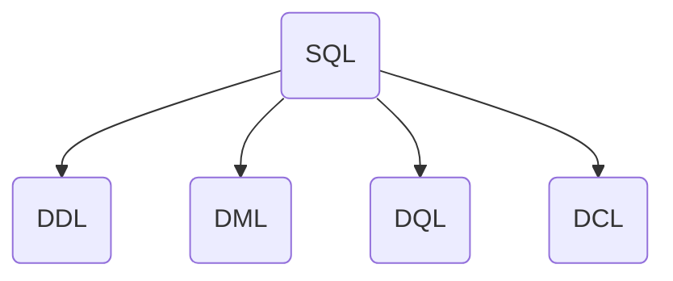

# 概念与安装

## 认识数据库

数据库体系包含三个基本概念：

1. 数据库（DataBase，简称DB）：存储数据的仓库，数据是有组织的进行存储。
2. 数据库管理系统（DataBase Management System，简称DBMS）：操纵和管理数据库的大型软件。
3. 结构化查询语言（Structured QueryLanguage，简称SQL）：操作关系型数据库的编程语言，定义了一套操作**关系型数据库**统一标准。


[主流数据库管理系统的市场占有率排名](https://db-engines.com/en/ranking)

### PostgreSQL数据库

本教程以[PostgreSQL](https://www.postgresql.org/)（简称：PgSQL）数据库为例，来介绍关系型数据库的使用和操作。PgSQL是一款功能强大的开源对象关系型数据库，它起源于加州大学伯克利分校的Ingres项目，1986 年开始发展至今，由全球社区维护且完全免费，允许商用和修改。

### 关系型数据库

关系型数据库是一种基于“关系模型”（即二维表格模型）来组织和存储数据的数据库。它将数据存储在由行和列组成的表（Table）中，表与表之间可以通过共享的字段（键）建立关系，从而高效地管理和查询结构化数据。


二维表可以理解为类似于Excel一样的表格，每个工作表都是一张表，表头是列，每一行是一条记录。


## PgSQL安装与启动

PgSQL网站提供了不同版本的安装程序，包括：Windows、Linux或MacOS。本教程使用[Docker](/docs/03-docker/a-安装.md)来安装PgSQL。


选择需要的PgSQL版本


查看镜像软件


创建PgSQL容器

```shell
docker run --name lesson-postgres -e POSTGRES_PASSWORD=123456 -p 5432:5432 -d postgres:18.1
```

* `--name lesson-postgres`设置容器的名称。
* `-e POSTGRES_PASSWORD=123456`设置数据库的密码。
* `-p 5432:5432`设置端口号。
* `-d postgres:18.1`使用镜像的版本。

查看PgSQL容器


运行镜像终端


在镜像终端中启动PgSQL命令行

```shell
psql -U postgres
```

* `-u postgres`数据库用户名。
*  本地服务器以`postgres`操作系统用户，无需密码。


使用`\q`可以退出PgSQL命令行工具。

## SQL

SQL（Structured QueryLanguage）结构化查询语言。操作关系型数据库的编程语言，定义了一套操作关系型数据库统一标准。根据功能，SQL语句分为四类



* DDL（Data Definition Language）：数据定义语言，用来定义数据库对象（数据库、表、字段）。
* DML（Data Manipulation Language）：数据操作语言，用来对数据库表中的数据进行增删改。
* DQL（Data Query Language）：数据查询语言，用来查询数据库中表的记录。
* DCL（Data Control Language）：数据控制语言，用来创建数据库用户、控制数据库的访问权限。
