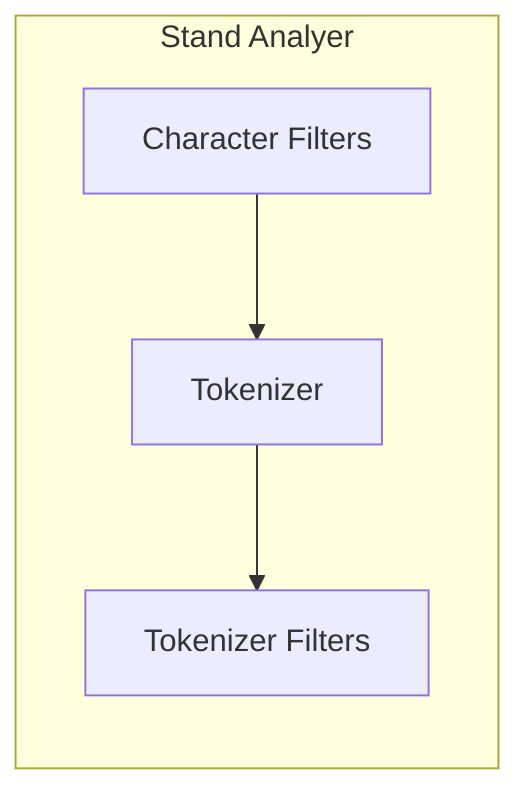

# Elasticsearch

## 概念

elasticsearch本质

- ES是一个文档数据存储系统，es可以存储、查询、搜索、更新、添加、删除json文档类型的数据。
- 可以被看着为一个NoSql系统。

elasticsearch分布式系统：

* 集群：一个或多个节点组织在一起

* 节点（node）：一个集群中的节点，即是一台服务器。

* 集群（cluster）：由一个或多个节点组成，对外提供服务。

* 分片（shard）：index会被拆分多个shard，每个shard会保存index的一部分数据，这些数据可以分配到一个或多个服务器上。便于横向扩展和并发

* 副本（replica）：shard的备份，一个shard可以有多个备份。可以分布在一台或多台服务器上。

elasticsearch核心概念，elasticsearch中没有db的概念，所有的表都放在一个db中。

| 关键字    | 名称 | 说明                          | mysql |
| --------- | ---- | ----------------------------- | ----- |
| index     | 索引 | es6开始索引相当于对每个表创建 | 表    |
| documents | 文档 | 用户存储的数据                | 行    |
| fields    | 字段 | 文档属性                      | 列    |

### documents

用json格式表示，一个document中有多个field，每个field就是一个数据字段。

元数据，用于标注文档的相关信息

* _index：文档所在的索引名。
  * document存放的index
  * 索引名必须是小写，不能用_开头不能包含逗号。
* _id：document的唯一标识。可以指定document的id，也可以系统自动创建。
  * 手动生成id
    1. 从系统外导入数据，用已有的唯一标识作为document的id。
    2. `PUT /index/type/id`
  * 自动生成id
    1. 将es本身作为数据库使用，可以让系统生成id。
    2. 生成id，长20个字符，url安全，base64编码，GUID，分布式并行时不可能发生冲突。
    3. `POST /index/type`。
* _source：文档原始json数据，可以获得每个字段内容，source可以定制返回结果。
* _all：整合所有字段内容到该字段，默认禁用。

### index

索引中存储具有相同结构的文档，例如：商品索引就存放了所有的商品数据。

* 每个索引都有自己的mapping定义，定义字段名称和类型。
* 一个集群可有有多个所有。

### fields

document的数据类型：

* 字符串：text、keyword（不会被分词器分析，全量保存）
* 数值型：long、interger、short、byte、double、float、half_float、scaled_float
* 布尔型：boolean
* 日期：date
* 二进制：binary（不能被检索）
* 范围类型：interger_range、float_range、long_range、double_range、date_range
* 复杂类型：object（对象），nested（对象组成的数组）
* 地理位置：geo-point，geo-shape
* 专业类型：ip，compeltion（搜索建议）

## Rest API

| 方法   | 描述                                                         | 对应es操作 |
| ------ | ------------------------------------------------------------ | ---------- |
| GET    | 请求指定的页面信息，并返回实体主体。                         | 查询       |
| POST   | 向指定资源提交数据进行处理请求。数据被包含在请求中。POST请求可能会导致新的资源建立或已有资源修改。 | 修改       |
| PUT    | 向服务器传送的数据取代指定文档内容。                         | 增加，修改 |
| DELETE | 请求服务器删除指定的页面。                                   | 删除       |

## ES基本操作

### 索引操作

使用 index api 创建、更新和删除所以配置等 

* index_name必须全部用小写，可以用下划线。
* 创建索引后shard数量不能修改

```shell
# 创建索引
PUT /test_index # 简单创建
PUT /test_index
{
    "settings": {
        "index": {
            "number_of_shards": 5, # 分片数量，
            "number_of_replicas": 1 # 副本数量
        }
    }
}

# 查看现有索引
GET _cat/indices

# 修改索引
PUT index_name/_setting 
{
    "number_of_replicas": 2 # 修改setting
}

PUT case/_settings?preserve_existing=true
{
  "index.max_result_window" : "300000" # 修改setting中返回最大查询结果的数量
}

# 删除索引
DELETE /test_index
```

### 文档操作

使用 document api 可以创建文档、查询文档、更新文档和删除文档。

* 创建文档时索引不存在会自动创建index
* 全量替换：重新对document建立索引替换里面的内容，删除原有数据。
* 对每个doc中的每个field都建立倒排索引，让其可以被搜索
* partial updata和全量替换的内部执行方式是一样的。

  * 所有的查询、修改和写会操作都发生在elasticsearch内部，避免网络开销。
  * 减少了查询和修改的时间间隔，可以有效减少并发冲突的情况。
* 删除：是标记为删除，物理上没有删除，当数据增加是，定期删除。

```shell
# 创建文档 
PUT /test_index/doc/1 # 指定id
{
    "username": "hugh",
    "age": 1
}

PUT /test_index/doc/1/_create { # 强制替换
    "username": "Tom",
    "age": 1
}

POST /test_index/doc # 不指定id，注意使用POST
{
    "username": "tom",
    "age": 20
}

# 查询文档
GET /test_index/doc/1
GET /test_index/doc/1?_source=username,age # 查询指定字段

# 搜索文档，使用 query dsl 语言查询
GET /test_index/doc/_search # 搜索全部数据
GET /test_index/doc/_search # 使用search查询id为1的文档
{
  "query": {
    "term": {
      "_id": "1"
    }
  }
}

# 修改文档
PUT /test_index/doc/1 # 覆盖修改，完全覆盖原文档
{
    "username": "hughxusu",
    "age": 10
}

POST /test_index/doc/1/_update # 增量修改，只修改一部分
{
    "doc": {
        "age": 30
    }
}

# 删除文档
DELETE /test_index/doc/1
```

### 批量操作

```shell
# 批量添加数据
POST _bulk
{"index":{"_index":"test_index", "_type":"doc", "_id":"1"}} # 指定插入位置，必须写成一行
{data} # 指定插入数据
{"index":{"_index":"test_index", "_type":"doc", "_id":"2"}} # 第二条插入数据，后面以此类推
{data}

# 批量删除数据
POST _bulk
{"delete":{"_index":"test_index", "_type":"doc", "_id":"1"}}

# 批量更新数据
POST _bulk
{"update":{"_index":"test_index", "_type":"doc", "_id":"2"}}
{"doc":{"age": 30}}

# 批量查询
GET _mget # 查询不同index数据
{
    "docs":[
        {"_index":"test_index", "_type":"doc", "_id":1},
        {"_index":"new", "_type":"doc","_id":2}
    ]
}

GET test_index/_mget # 查询相同index
{
    "docs":[
        {"_type":"doc", "_id":1},
        {"_type":"doc", "_id":2}
    ]
}

GET test_index/doc/_mget # 查询相同index/type
{
    "docs":[
        {"_id":1},
        {"_id":2}
    ]
}

GET test_index/doc/_mget # 同上
{
    "ids":[1,2]
}
```

## 搜索基础

### 索引

正排索引：文档id到文档内容（单词）的关系。

倒排索引：文档内容（单词）到文档id的关系。


倒排索引是搜索引擎的核心内容，主要包括：

* 单词词典（Term Dictionary）
  * 记录了所有文档的单词，一般比较大。
  * 记录单词与倒排列表的关联关系，单词字典一般采用B+Tree的实现。
  * 主要用于文档的拆分和倒排列表的插入。
* 倒排列表（Posting List），记录了单词对应的文档集合，有倒排索引项组成。
  * 倒排索引项
    * 文档id，用于获取原始信息。
    * 单词频率（TF，Term Frequency），记录该单词在文档中出现的次数，用于后续相关性算分。
    * 位置（Position），记录单词在文档中的分词位置（多个），用于做词语搜索（Phrase Query）
    * 偏移（Offset），记录单词在文档的开始和结束位置，用于做高亮显示。
  * 倒排索引主要用于文档拆分。

Elasticsearch存储的是一个json格式的文档，其中包含多个字段，每个字段会有自己的倒排索引。

### 分词

分词是指将文本转换成一系列单词的过程，也叫文本分析。在Elasticsearch中成为Analysis。分词会在创建文档和查询语句中使用。

分词器是Elasticsearch中专门处理分词的组件，英文为Analyzer。

* Character Filters：针对原始文本进行处理，比如去除html特殊标记符。
* Tokenizer：将原始文本按照一定规则切分为单词。
* Tokenizer Filters：针对切分的单词在加工，比如转换为小写，删除或新增等处理。



### 分词器Api

一般不需要特别指定查询时分词器，默认使用索引时分词器即可，但是可以单独指定不同的分词器。

Elasticsearch自带分词器：

* standard 默认分词器，按词切分支持多语言、小写处理。
* simple 按照非字母切分，小写处理。
* whitespace 按照空格切分
* stop 按照语气助词等修饰性词语分词，比如the、an、的、这等
* keyword 不分词，直接将文本作为一个单词输出
* pattern 通过正则表达式自定义切分符号，默认是`\W+`，即非字词的符号作为分隔符。
* language 常见语言分词器，根据语言特性切分。

中文分词ik分词器

自定义分词器：

1. Character Filters：
   * html strip（去除html标签和转换html实体）
   * mapping进行字符替换
   * pattern replace进行正则匹配替换
2. tokenizer
   * standard 按照单词进行分隔
   * letter 按照非字符类进行分割
   * whitespace 按照空格进行分割
   * UAX URL Email 按照standard分割，但不会分割邮箱和url
   * NGram 和Edge NGram连词分割
   * Path Hierarchy 按照文件路径进行切割
3. Tokenizer Filters
   * lowercase 将所有term转为小写
   * stop 删除stop words
   * NGram 和Edge NGram连词分割
   * synonym 添加近义词trem

```shell
# 指定analyzer进行测试
POST _analyze
{
	"analyzer": "standard",
	"text": "hello world!"
}

GET _analyze
{
	"analyzer": "ik_max_word", # 中文分词，分词方法ik_max_word和ik_smart
  "text":"python网络"
}

# 针对索引指定字段测试分词器 
POST /test_index/_analyze
{
  "field": "username", # 测试username使用的分词器
  "text": "hello world!" # 测试文本
}

# 自定义分词器
POST _analyze # 指定Character Filters
{
  "tokenizer": "keyword",
  "char_filter": ["html_strip"], # html过滤
  "text": "<p>I&aspos;m so<b>happy</b></p>"
}

POST _analyze # 按照文件路径进行切割
{
  "tokenizer": "path_hierarchy",
  "text": "/one/two/three"
}

POST _analyze # 指定Tokenizer和Tokenizer Filters
{
  "text": "a Hello, world!",
  "tokenizer": "standard",
  "filter": [
    "lowercase",
    "stop",
    {
      "type": "ngram", # NGram 过滤和参数
      "min_gram": 4,
      "max_gram": 4
    }
  ]
}

# 在索引中指定分词器
PUT test_index
{
  "settings": {
    "analysis": {
      "char_filter": {},
      "tokenizer": {},
      "filter": {},
      "analyzer": {}
    }
  }
}

PUT test_index # 示例
{
  "settings": {
    "analysis": {
      "analyzer": {
        "custom_analyzer":{
          "type": "custom",
          "tokenizer": "standard",
          "char_filter":[
            "html_strip"
            ],
          "filter": [
            "lowercase",
            "asciifolding"
            ]
        }
      }
    }
  }
}

POST /test_index/_analyze # 测试自定义分词器
{
  "analyzer": "custom_analyzer", 
  "text": "hello world!"
}
```

## 映射（mapping）

映射：类似于数据库中的表结构定义。在创建索引时，可以预先定义字段类型和相关属性，属性指示Elasticsearch如何索引数据以及是否可以被搜索。

* 定义index下的字段名称和字段类型。
* 定义倒排索引的相关配置，比如是否索引、记录position等。
* mapping类型一旦创建，就不能修改。
* 创建好mapping后添加数据应该与mapping一致，否则会报错。

如何定义mapping

1. 写入一条文档到Elasticsearch的临时索引中，获取自动生成的mapping。
2. 修改步骤1得到的mapping，自定义相关配置。
3. 使用步骤2的mapping创建实际所需的索引。

### mapping设置

mapping参数

| 属性                  | 描述                                                         |
| --------------------- | ------------------------------------------------------------ |
| type                  | type名称，均用doc                                            |
| properties            | 字段名称和定义                                               |
| dynamic               | 新增字段控制：true（默认）允许自动新增字段。false不允许自动新增字段，但文档可以正常写入，但无法对字段进程查询操作。strict文档不能写入，报错。 |
| dynamic_date_fromates | 日期格式设置如                                               |
| date_detection        | 日期自动检测                                                 |
| numeric_detection     | 数字自动检测                                                 |

字段参数

| 属性           | 描述                                                         |
| -------------- | ------------------------------------------------------------ |
| type           | 字段类型x                                                    |
| index          | 字段是否索引，默认为true，true索引，false不索引（不可搜索）。 |
| index_options  | 控制倒排索引记录的内容：docs只记录id；freqs只记录id和terms frequencies；position记录id、terms frequencies和trem position；offset记录id、terms frequencies、trem position和character offsets；默认是docs。 |
| copy_to        | 将该字段的值复制到目标字段，不会出现在_source中，只用来搜索。 |
| null_value     | 如果字段为空默认是忽略处理，可以设置一个默认值，比如`NA`     |
| store          | yes表示存储，no表示不存储，默认为no                          |
| analyzer       | 可以设置索引和搜索时用的分析器，默认使用standard分析器，还可以使用whitespace、simple、english |
| include_in_all | 默认es为每个文档定义一个特殊域_all，它的作用是让每个字段被搜索到，如果不想某个字段被搜索到，可以设置为false |
| format         | 时间格式字符串的模式                                         |
| dynamic        | 功能同mapping中的字段，可以在object 类型中使用。             |

多字段特性multi-fields：允许对同一个字段采用不同的配置。

```shell
# 查询mapping
GET test_index/_mapping 

# 创建index时设置
PUT new_index
{
  "mappings": { # mappings关键词
    "doc": { # type名称，均用doc
    	"dynamic": false, # 新增字段控制
    	"dynamic_date_fromates": ["MM/dd/yyyy"], # 日期格式设置
    	"date_detection": false, # 日期自动检测
    	"numeric_detection": false, # 数字自动检测
      "properties": { # 字段名称和定义
        "title": {"type":"text"},
        "name": {"type":"keyword"},
        "age": {"type":"integer"}
        "social": {
        	"dynamic": true, # 新增字段控制
        	"properties": {}
        }
      }
    }
  }
}

PUT name 
{
  "mappings": {
    "doc": { 
      "properties": { 
        "first_name": {"type":"text", "copy_to": "full_name"},
        "last_name": {"type":"text", "copy_to": "full_name"},
        "full_name": { # 添加时不用添加full_name自动添加
        	"type":"text"
        	"pinyin": { # 多字段特性，对字段进行拼音分词
        		"type": "text",
        		"analyzer": "pinyin"
        	}
        } 
      }
    }
  }
}

PUT request 
{
  "mappings": {
    "doc": { 
      "properties": { 
        "cookie": {
        	"type": "text",
        	"index": false,
        	"index_options": "offsets",
        	"null_value": "NULL"
        }
      }
    }
  }
}
```

### 动态类型

Elasticsearch可以自动识别文档字段类型，从而降低用户使用成本。

* 自动识别的string类型会附带keyword子字段。
* 日期类型的string可以自动识别。

针对自动识别出的类型设置匹配规则

```shell
PUT new_index
{
  "mappings": {
    "doc": { 
      "dynamic_templates": [ # 数组，可指定多个匹配规则
      	  "strings": { # 模板名称
        	"match_mapping_type": "string" # 匹配自动识别的字段类型
        	"match": "massage*", # 设置自动匹配规则，已massage开的头的string字段
        	"mapping": { # 设置mapping信息
        		"type": "keyword"
        	}
        }
      ]
    }
  }
}
```

### 索引模板

用于在新建索引是自动应用预先设定的配置，简化索引创建的操作步骤。

* 可以设定索引的配置和mapping
* 可以有多个模板，根据order设置，order大的覆盖小的配置。

```shell
# 设置模板
PUT _template/test_template
{
	"index_pattern": ["te*", "bar*"], # 匹配索引名称
	"order": 0, # 配置顺序
	"setting": { # 索引配置
		"number_of_shards": 1
	},
	"mapping": {
		"doc": {
			"_source": {
				"enabled": false
			},
			"properites": {
				"name": {
					"type": "keyword"
				}
			}
		}
	}
}

# 查询模板
GET _template
GET _template/test_template

# 删除模板
DELETE _template/test_template
```

## 查询

Elasticsearch通过对文档进程分词，建立倒排索引实现文档的快速搜索。

==search api 是以`_search`为结尾的请求路径==

```shell
GET /_search  # 所有索引，所有type下的所有数据都搜索出来
GET /index_one/_search # 指定一个index，搜索其下所有type的数据
GET /index_one, index_two/_search # 同时搜索两个index下的数据

# 按照通配符去匹配多个索引
GET /index*/_search
GET /*1,*2/_search 

GET /index_one/doc/_search # 搜索一个index下指定的type的数据
```

Elasticsearch查询方式有两种

* URI Search 查询请求中包含查询内容
* Request Body Search使用query dsl语法查询。query dsl：是Elasticsearch的查询语言，使用json功能封装了Elasticsearch的查询。

```shell
# URI Search
GET /index_one/_search?q=user:alfred

# Request Body Search
GET /index_one/_search
{
	"query": {
		"term": {"user": "alfred"}
	}
}
```

### URI Search

通过url参数来实现搜索：

* q 指定查询的语句
* df 查询字段（如果df和q不指定默认字段时es会查询索引字段）
* sort 排序
* timeout 可以在相应时间内完成搜索返回部分搜索到的数据，默认是没有timed_out时间。
* from, size 用于分页

```shell
GET /index_one/_search?q=hugh&df=user&sort=age:asc&from=4&size=10&timeout=1s
```

uri查询语法

* term与phrase
  * `hello world` 等效于 hello or world
  * `"hello world"` 词语查询，有先后顺序
* 泛查询：等效于在所有字段去匹配该term
* 指定字段：`user:alfred`
* group分组，使用括号指定匹配的规则
  * `(quick OR brown) AND fox`
  * `status:(active OR pending) title:(full text search)`
* 布尔操作符：AND（&&）、OR（||）、NOT（!）（不可以小写）：`name:(tom NOT lee)`、`name:(tom && !lee)`
* `+ `等于must、`-`等于must_not：`name:(tome +lee -hugh)`（在url中`+`会被解析成空间需要用`%2B`代替`name:(tome %2Blee -hugh)`）
* 范围查询，支持数值和日期
  * 区间写法，闭区间`[]`，开区间`{}`
    * `age:[1 TO 10]`等于$1 \le age \le 10$
    * `age:[1 TO 10}`等于$1 \le age \lt 10$
    * `age:[1 TO]`等于$age \ge 1$
    * `age:[* TO 10}`等于$age \le 10$
  * 算数符号写法
    * `age:>=1`
    * `age:(>=1 && <=10)` 或`age:(+ >=1 +<=10)`
* 通配符查询：`?`代表一个字符；`*`代表0或多个字符。通配符运行效率低，不建议使用。
* 查询字段中可以使用正则表达式符号。运行效率低，不建议使用。
* 模糊匹配：`name:roam~1`与roam差一个字符的单词都可以匹配。
* 近似度匹配：`"fox quick"~5`以term的概念进行匹配和fox quick差5个单词的词组都可以匹配。

### 查询结果

elasticsearch相关性算分模型包括：1. TF/IDF模型；2. BM25模型（5.0后默认模型）。

```json
// 查询结果格式
{
  "took" : 10, // 查询耗时，单位ms
  "timed_out" : false,
  "_shards" : { // 请求分配到几个shard上，默认情况是分配到所有shard上
    "total" : 5,
    "successful" : 5,
    "skipped" : 0,
    "failed" : 0
  },
  "hits" : {
    "total" : 1, // 符合条件的文档数量
    "max_score" : 1.0, // 相关度最高分
    "hits" : [ // 返回文档详情数组，默认前10个文档
      {
        "_index" : "test_index", // 索引名称
        "_type" : "doc",
        "_id" : "1", // 文档id
        "_score" : 1.0, // 文档得分
        "_source" : {  // 文档详情
          "username" : "hugh",
          "age" : 1
        }
      }
    ]
  }
}
```

### Request Body Search

通过请求体进行查询，包括：1. query符号Query DSL语法的查询语句；2. form，size；3. timeout；4. sort等

Query DSL查询语言，基于json格式的查询语言，主要包括查询：

* 字段查询：如trem、match、range等，只针对某一个字段进行查询。
  * 全文匹配：针对text类型字段进行全文搜索，会对查询词语进行分词处理，如：match、match_phrase等查询类型
  * 单词匹配：不会对查询词语做分词处理，直接去匹配倒排索引，如：term、terms、range等查询类型

* 复合查询：如bool查询等，包含一个或多个字段查询或者复合查询语句。
* 符合查询语法的josn格式可以任意嵌套或者组合。

#### 字段查询

```shell
# match
GET /test_index/doc/_search
{
  "query": { # 查询关键字
    "match": { # 匹配方式关键字，match查询会对查询内容分词，没有顺序要求
      "txt": "django python" # 查询字段: 查询内容
    }
  }
}

GET /test_index/doc/_search
{
  "query": {
    "match": {
      "txt": { # 查询字段
        "query": "django python", # 查询内容
        "operator": "and" # 分词链接方式，默认分词链接方式是or
      }
    }
  }
}

GET /test_index/doc/_search
{
  "query": {
    "match": {
      "txt": {
        "query": "django python",
        "minimum_should_match": "2" # 匹配单词个数
      }
    }
  }
}

GET /test_index/doc/_search
{
  "explain": true, # 显示相关性算分
  "query": {
    "match": {
      "txt": "django python"
    }
  }
}

# match_phrase
GET /test_index/doc/_search
{
    "query": {
        "match_phrase": { # 短语搜索，需要完整匹配，且有顺序
            "txt": "Django without"
        }
    }
}

GET /test_index/doc/_search
{
    "query": {
        "match_phrase": { 
            "txt": {
                "query": "Django without",
                "slop": 6 # 6 分词距离，例子：python 系统 两个词直接不能超过6个字
            }
        }
    }
}

# query string 使用uri查询语法
GET /test_index/doc/_search
{
  "query": {
    "query_string": { # 查询字符串
      "default_field": "txt", # 查询字段
      "query": "python AND django" # 查询内容
    }
  }
}

GET /test_index/doc/_search
{
  "query": {
    "query_string": {
      "fields": ["txt", "title"], # 指定多个查询字段
      "query": "python AND django"
    }
  }
}

GET /test_index/doc/_search
{
  "query": {
    "simple_query_string": {
      "fields": ["txt"],
      "query": "python +django" # uri查询语法
    }
  }
}

# trem 查询不会对查询条做分词处理。
GET /test_index/doc/_search
{
  "query": {
    "term": {
      "txt": "python django"
    }
  }
}

# terms 查询多个概念，一个有一个满足，结果就会被返回
GET /test_index/doc/_search
{
  "query": {
    "terms": {
      "txt": ["python", "django"]
    }
  }
}

# range query 范围查询
GET /test_index/doc/_search
{
	"query": {
		"range": { # 关键词
			"age": { # 字段
				"gte": 10, # gte大于等于，gt大于
				"lte": 20, # lte小于等于，lt小于
				"boost":2.0 # "boost":2.0表示字段权重
			}
		}
	}
}


GET /test_index/doc/_search
{
    "query": {
        "range": {
            "add_time": {
                "gte":"2017-04-01||+10d", # 开始时间
                "lte":"now - 1d", # 结束时间，当前时间减1天。
                # 时间计算y/M//w/d/h/m/s，年/月/日/周/天/时/分/秒
                # +， -， /d（取整到天），||（隔离具体日期）
            }
        }
    }
}
```

#### 复合查询

复合查询是值包含字段类查询或复合查询的类型，主要包括

* constant_score query 将其内部查询结果得分都设定为1或者boost的值，多用于结合bool查询实现自定义得分。
* bool query 由一个或多个布尔句子组成，主要包括：
  * `filter` 只过滤符合条件的文档，不计算相关性得分。filter会有只能缓存，执行效率高，做简单匹配不考虑得分时，推荐使用filter代替query。
  * `must` 文档必须符合所有条件，会影响相关性得分
  * `must_not` 文档中必须==不==符合所有条件
  * `should`文档可以符合条件，会影响相关性得分

```shell
bool：{
		# 数组表示多个查询字段
    "filter":[], # 对字段进行过滤，不参与打分
    "must":[], # 必须满足数组里的所有查询
    "should":[], # 可以满足数组里的一个或多个查询条件
    "must_not":[], # 排除数组里查询条件
}
```

* dis_max query
* function_score query
* boosting query

```shell
# constant_score query
GET test_index/doc/_search
{
  "query": {
    "constant_score": {
      "filter": {
        "match": {
          "txt": "django"
        }
      },
      "boost": 1.2
    }
  }
}

# bool query
GET test_index/doc/_search
{
  "query": {
    "bool": {
      "filter": { # 简单过滤
        "term": {
          "txt": "django"
        }
      }
    }
  }
}

GET test_index/doc/_search
{
    "query": {
        "bool": {
            "filter":{
                "terms":{
                    "salary":[10, 20]
                }
            }
        }
    }
}

GET index_name/_doc/_search
{
    "query": {
        "bool": {
            "filter":{
                "exists":{ # 掉空字段
                    "field":"tags"
                }
            }
        }
    }
}

GET test_index/doc/_search
{
  "query": {
    "bool": {
      "must": [
        {"match": {"txt": "django"}},
        {"match": {"title": "django"}}
      ]
    }
  }
}

GET test_index/doc/_search
{
  "query": {
    "bool": {
      "must": [{"match": {"txt": "django"}}],
      "must_not": [{"match": {"txt": "python"}}]
    }
  }
}

GET test_index/doc/_search # 只包含should
{
  "query": {
    "bool": {
      "should": [ 
        {"term": {"txt": "python"}},
        {"term": {"txt": "django"}}
      ],
      "minimum_should_match": 2 # 最少满足条件数量
    }
  }
}

GET test_index/doc/_search # must + should
{
  "query": {
    "bool": {
      "must": [{"term": {"txt": "python"}}], # 必须包含字段
      "should": [{"term": {"txt": "django"}}] # 可以不包含字段，但是如果有相关性算分会更高
    }
  }
}

GET test_index/doc/_search
{
  "query": {
    "bool": {
      "must": [{"term": {"txt": "python"}}],
      "filter": [{"term": {"txt": "django"}}] # 不需要相关性算分的用filter过滤
    } 
  }
}


GET index_name/_doc/_search # 嵌套查询 title==python or (title==elasticsearch and salary==30)
{
    "query": {
        "bool": {
            "should": [
                {"term":{"salary":20}},
                {
                    "bool": {
                        "must": [
                            {"term":{"title":"elasticsearch"}},
                            {"term":{"salary":30}}
                        ]
                    }
                }
            ]
        }
    }
}
```

### 其他查询api

```shell
# 返回全部结果
GET index_name/_search # 可以不加type
{
    "query": {
        "match_all": {}
    }
}

# _source 过滤返回结果字段
GET index_name/_doc/_search
{
	"_source": false # 不返还_source
}

GET index_name/_doc/_search
{
	"_source": ["txt", "title"] # 返回部分字段
}

GET index_name/_doc/_search
{
	"_source": {
		"includes": "*i*",
		"excludes": "birth"
	}
}

# 模糊搜索
GET index_name/_doc/_search
{
    "query": {
        "fuzzy": { # 不需要精确匹配
            "title": "百度限公司"
        }
    }
}

GET index_name/_doc/_search
{
    "query": {
        "wildcard": { # 模糊查询
            "title": {
								"value":"pyth*n",
                "boost":2.0
            }
        }
    }
}

# 高亮搜索
GET /index/type/_search {
    "query":{
        "match":{
            "producer":"producer"
        }
    },
    "highlight":{
        "fields":{
            "producer":{}
        }
    }
}

# 匹配多个字段
GET index_name/_doc/_search
{
    "query": {
        "multi_match": { # 多字段匹配
            "query":"python", # 查询的内容
            # 在多个字段中擦查询，"title^3","desc" title的权重是desc的3倍
            "fields":["title^3","desc"], 
        }
    }
}

# 指定返回字段
GET index_name/_doc/_search
{
    # 指定要返回的字段，必须是mapping中stored为true的字段
    "stored_fields":["title","company_name"], 
    "query": {
        "match": {
            "title": "python"
        }
    }
}


```

## Count API

统计符合条件的文档数

```shell
GET test_index/doc/_count
{
  "query": {
    "match": {
      "title": "django"
    }
  }
}


```

## Suggester（补全搜索建议）

在mapping中增加suggest字段

```shell
PUT music
{
    "mappings": {
        "_doc" : {
            "properties" : {
                "suggest" : { # 增加补全字段
                    "type" : "completion" # 字段类型是completion
                },
                "title" : {
                    "type": "keyword"
                }
            }
        }
    }
}
```

数据保存

```shell
PUT music/_doc/1?refresh
{
  "suggest" : [ "Nevermind", "Nirvana" ] # 添加搜索建议
}
```

搜索

```shell
POST music/_search?pretty
{
    "suggest": {
        "song-suggest" : { # 建议名称可以自定义
            "text" : "linux", 
            "completion" : { 
                "field" : "suggest", # 搜索建议字段
                "fuzzy": { 
            			"fuzziness": 2
        				}
            }
        }
    },
    "_source": "title" # 指定搜索结果要显示的字段
}
```

## Search运行机制

Serarch 执行是分两步运行：1. query阶段；2. fetch阶段。

### 排序

排序过程实际是对字段原始内容进行排序，这个过程中倒排索引无法发挥作用，需要用到正排索引。

`Fielddata`排序字段

```shell
GET index_name/_doc/_search
{
    "query": {
        "match_all": {}
    },
    "sort": [{
        "comment": { # 需要排序的字段，可以使用多个排序字段
            "order":"desc" # 排序方式asc升序，desc降序
        }
    }]
}

GET index_name/_doc/_search
{
	"sort": {
		"username": "desc" # 按字符串排序
	}
}

GET index_name/_doc/_search
{
	"sort": {
		"username.keyword": "desc" # 按字符串排序
	}
}
```

### 分页

默认设置可查询的数据是10000条。

scroll快照分页

search_after，不能指定页数，只能跳上一页和下一页

```shell
GET index_name/_doc/_search
{
    "query": {
        "match": {
            "title": "python"
        }
    },
    "from":0, # 从0条开始
    "size":2 # 返回2条
}
```


## 简单集群管理

elasticsearch是一个分布式系统。

cerebro是一个elasticsearch的集群管理插件。

检测集群健康状况

```shell
GET _cat/health # 检查集群健康状况
GET _cat/health?v  # ?v参数
GET _cat/indices?v # 查看索引
```

## 聚合分析

聚合分析是elasticsearch针对数据统计分析的功能：

* 功能丰富，提供了Bucket、Metric、Pipline等多种分析方式，可以满足大部分分析需求。
* 实时性高，所有计数结果即使返回。
* 聚合分析作为search api的一部分。

```shell
GET /index/type/_search
{
	"size": 0
	"aggs": {
		"[自定义聚合名称]": {
			"[聚合类型]": {
				[聚合内容]
			}
		}
		[,"aggs":{[子查询]}] # 对前面聚合的结果进行子查询
	}
	[可以包括多个聚合分析用数组表示]
}
```

### Bucket

分桶类型，类似于sql中的group by语法

### Metic

指示分析类型，如技术最大值、最小值、平均值等等

* 单值分析：min、max、avg、sum、cardinality
* 多值分析：stats、extended stats、percentile、percentile rank、top hits

### Pipeline

管道分析类型，基于上一级的聚合分析结果，进行再分析。

### Matrix

矩阵分析类型，多维度聚合分析


```shell
GET /index/type/_search {
	"size":0,
    "aggs":{ # 表示聚合
        "group_by_tags": { # 聚合名称
            "terms": { # 哪种聚合
                "field": "tags" # 字段
            }
        }
    }
}

GET /index/type/_search {
	"size":0,
	"query":{
        "match":{
            "name", "yagao"
        }
	}
    "aggs":{ # 表示聚合
        "group_by_tags": { # 聚合名称
            "terms": { # 哪种聚合
                "field": "tags" # 字段
            }
        }
    }
}

GET /index/type/_search {
	"size":0,
    "aggs":{ # 表示聚合
        "group_by_tags": { # 聚合名称
            "terms": { # 哪种聚合
                "field": "tags" # 字段
            },
            "aggs":{
            	"avg_price":{
                	"avg":{
                    	"field":"price"
                    }
                }
            }
        }
    }
}

GET /index/type/_search {
	"size":0,
    "aggs":{ # 表示聚合
        "group_by_tags": { # 聚合名称
            "terms": { # 哪种聚合
                "field": "tags", # 字段
                "order":{
                    "avg_price":"desc"
                }
            },
            "aggs":{
            	"avg_price":{
                	"avg":{
                    	"field":"price"
                    }
                }
            }
        }
    }
}
```


## Python交互

### Python交互模块

* elasticsearch_dsl类似于Django中的model模块
* elasticsearch类似于MySQL的底层模块

### Elasticsearch dsl

#### 创建index

```python
from elasticsearch_dsl import Document, Text, Integer

# 自定义分词器
zh_analyzer = analyzer('zh_analyzer', tokenizer='ik_max_word', # 分词器
                       filter=['standard', 'lowercase', 'stop'], # 过滤器
                       char_filter=['html_strip']) # 字符处理

# 定义mapping
class CourtDocuments(Document):
    pk = Integer() # 字段类型
    title = Text(analyzer=zh_analyzer) # 使用分词器
    txt = Text(analyzer=zh_analyzer)
    
    class Index:
      name = 'court_documents' # 索引名称
      settings = {
        "number_of_shards": 2,
        "number_of_replicas": 0
      }

connections.create_connection(hosts=es_ip, timeout=30) # 创建elasticsearch连接
CourtDocuments.init() # 初始化index mapping
```

#### document操作

```python
try:
  item = CourtDocumentsIndex.get(id=pk) # 根据id获取数据
  item.delete() # 删除document
except NotFoundError:
	pass

connections.create_connection(hosts=es_ip, timeout=30)
item = CourtDocumentsIndex(meta={'id': 1}) # item = CourtDocumentsIndex() item.meta.id = instance.pk 等价操作
item.title = '标题' 
item.txt = '内容'
item.save() # 保存document
```

#### 搜索操作

```python

```


